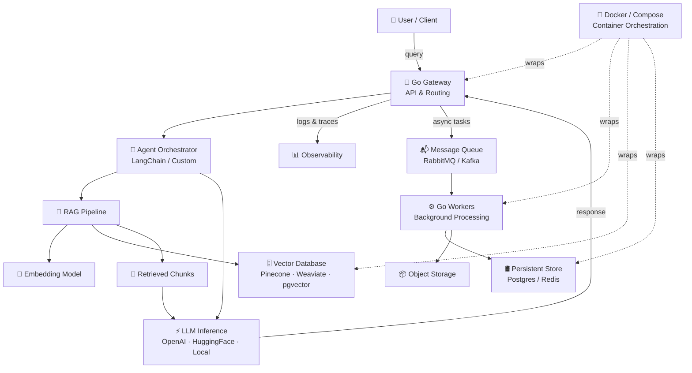

<div align="center">

<!-- HEADER -->


<br/>

<!-- TYPING ANIMATION -->


<br/><br/>

<!-- SOCIAL BADGES -->
<a href="https://www.linkedin.com/in/asmit-regmi-25546132a/">
  
</a>
&nbsp;
<a href="#">
  
</a>
&nbsp;
<a href="mailto:asmitregmi1991@gmail.com">
  
</a>
&nbsp;


</div>

---

```
[SYS]  Initializing profile...
[OK ]  Core modules loaded: Python · Go · LLMs · RAG · Vector DBs · Docker
[OK ]  Status: open to opportunities
[RUN]  Hello, World!  —  Asmit Regmi
```

---

## 01 · About


Computer Science Engineering student focused on **AI Engineering**, **LLM Systems**, and **production-grade ML pipelines** — with a growing interest in the infrastructure that makes intelligent systems actually ship. I build end-to-end: from prompt design and retrieval architecture all the way to containerised, distributed backends.

I'm drawn to the full stack of AI delivery — not just training models, but getting them into reliable, scalable systems. That means **RAG pipelines**, **vector search**, **Go-powered microservices**, and **Docker-first deployments** that don't break under load.

Outside engineering: competitive chess player and college **Chess Captain**.

- **Building:** RAG pipelines · Agentic LLM workflows · Vector search systems
- **Infra:** Distributed services in Go · Docker & container orchestration
- **Exploring:** Fine-tuning · RLHF · Prompt engineering at scale
- **Achievement:** Winner — *All India Esport Chess Championship* 🏆

<br clear="right"/>

---

## 02 · GitHub Stats

<div align="center">


&nbsp;


<br/><br/>


</div>

---

## 03 · AI Engineering Stack

<div align="center">


</div>

> *AI systems that don't ship aren't AI systems — they're research. I care about the full delivery path: retrieval, inference, serving, and scale.*

---

## 04 · Architecture Map



---

## 05 · Status Log

```
╔════════════════════════════════════════════════════════════════╗
║                  KNOWLEDGE BASE · STATUS                       ║
╠════════════════════════════════════════════════════════════════╣
║  [✓] LLM fundamentals & APIs      [✓] RAG architecture         ║
║  [✓] vector embeddings             [✓] semantic search          ║
║  [✓] transformer attention         [✓] HuggingFace ecosystem    ║
║  [✓] Docker & containerisation     [✓] Go microservices         ║
║  [✓] REST API design               [✓] Python ML pipelines      ║
║  [~] agentic frameworks            [~] vector DB optimisation   ║
║  [~] fine-tuning & RLHF            [~] distributed tracing      ║
║  [~] prompt engineering at scale   [ ] Kubernetes / k8s         ║
║  [ ] multi-modal models            [ ] model serving (vLLM/TGI) ║
╠════════════════════════════════════════════════════════════════╣
║   [✓] operational   [~] loading   [ ] queued                   ║
╚════════════════════════════════════════════════════════════════╝
```

---

## 06 · Skills

<div align="center">

**LLM & AI Engineering**


<br/>

**ML & Data**


<br/>

**Backend & Infrastructure**


<br/>

**Dev & Tooling**


</div>

---

## 07 · Activity

<div align="center">

</div>

---

## 08 · Connect

<div align="center">

```
  roles  ──  AI engineer · backend · LLM systems · research
  open   ──  internship · full-time · collaboration
```

<br/>

<a href="https://www.linkedin.com/in/asmit-regmi-25546132a/">
  
</a>
&nbsp;
<a href="#">
  
</a>
&nbsp;
<a href="mailto:asmitregmi1991@gmail.com">
  
</a>

<br/><br/>


</div>
