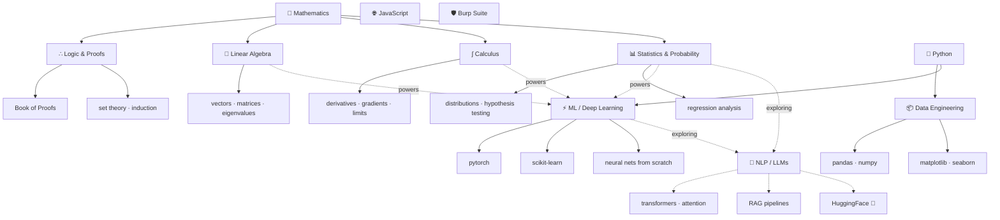

<div align="center">

<!-- HEADER — black terminal bar via capsule-render -->


<br/>

<!-- TYPING ANIMATION — external SVG service, always renders -->


<br/><br/>

<!-- SOCIAL BADGES -->
<a href="https://www.linkedin.com/in/asmit-regmi-25546132a/">
  
</a>
&nbsp;
<a href="#">
  
</a>
&nbsp;
<a href="mailto:asmitregmi1991@gmail.com">
  
</a>
&nbsp;


</div>

---

```
[SYS]  Initializing profile...
[OK ]  Core modules loaded: Python · ML · Stats · Deep Learning · Pure Mathematics
[OK ]  Status: open to opportunities
[RUN]  Hello, World!  —  Asmit Regmi
```

---

## 01 · About


Computer Science Engineering student focused on **Machine Learning**, **Deep Learning**, and **Computer Vision** — grounded in a genuine passion for **mathematics**. I study model mechanics from the ground up: proving things by hand before trusting a library, writing neural networks from scratch, understanding statistical inference, and exploring modern transformer architectures.

I spend a lot of free time working through **proof-based mathematics** — currently going through *Book of Proofs* (Hammack) — alongside linear algebra, real analysis, and calculus, because I'd rather understand *why* an algorithm works than just call `.fit()`.

Outside engineering: competitive chess player and college **Chess Captain**.

- **Exploring:** Transformer attention · Vector embeddings · RAG pipelines
- **Foundation:** Mathematical proof & logic · Linear algebra · Calculus · Statistical inference · Optimisation theory
- **Currently reading:** *Book of Proofs* — Richard Hammack
- **Achievement:** Winner — *All India Esport Chess Championship* 🏆

<br clear="right"/>

---

## 02 · GitHub Stats

<div align="center">


&nbsp;


<br/><br/>


</div>

---

## 03 · Mathematical Foundations

<div align="center">


</div>

> *Math isn't a prerequisite I got past — it's the part of ML I enjoy most. Every model in `04 · Knowledge Graph` below traces back to a proof, a matrix, or a derivative up here.*

---

## 04 · Skills

<div align="center">


</div>

---

## 05 · Knowledge Graph



---

## 06 · Status Log

```
╔════════════════════════════════════════════════════════════════╗
║                  KNOWLEDGE BASE · STATUS                       ║
╠════════════════════════════════════════════════════════════════╣
║  [✓] proofs & mathematical logic   [✓] linear algebra          ║
║  [✓] differential & integral calc  [✓] bayesian statistics     ║
║  [✓] gradient descent & backprop   [✓] ensemble methods         ║
║  [✓] regularisation (L1 / L2 / DO) [✓] cross-validation         ║
║  [~] real analysis                 [~] transformer architecture ║
║  [~] attention mechanisms          [~] RAG pipelines            ║
║  [~] prompt engineering            [ ] fine-tuning & RLHF       ║
║  [ ] vector databases                                           ║
╠════════════════════════════════════════════════════════════════╣
║   [✓] operational   [~] loading   [ ] queued                   ║
╚════════════════════════════════════════════════════════════════╝
```

---

## 07 · Stack

<div align="center">

**Mathematics**


<br/>

**ML & AI**


<br/>

**Data**


<br/>

**Dev & Security**


</div>

---

## 08 · Activity

<div align="center">

</div>

---

## 09 · Connect

<div align="center">

```
  roles  ──  ML engineer · data scientist · AI research
  open   ──  internship · full-time · collaboration
```

<br/>

<a href="https://www.linkedin.com/in/asmit-regmi-25546132a/">
  
</a>
&nbsp;
<a href="#">
  
</a>
&nbsp;
<a href="mailto:asmitregmi1991@gmail.com">
  
</a>

<br/><br/>


</div>
